# Rio Flex

**Software de controle inteligente de recarga de veículos elétricos.** Recebe sinais de preço do mercado de energia e os repassa ao consumidor, dando mais controle e flexibilidade à rede e construindo uma relação de **confiança** com quem carrega o carro. A interface operacional do desafio aparece no enunciado como *Rio-Felix*; neste repositório ela se chama **Rio Flex**.

> **Como ler este documento.** Cada capacidade recebe um selo de estado, para que nada futuro seja apresentado como pronto:
> `✅ Implementado` (existe no código e foi exercitado) · `🟡 MVP/Parcial` (existe de forma simulada ou reduzida) · `🔵 Planejado` (desenho, sem código).
> Os caminhos citados em "Evidência" existem no repositório.

**Índice:** [1. Critério de avaliação](#1-critério-de-avaliação) · [2. Arquitetura](#2-arquitetura-da-solução) · [3. Cavuca](#3-cavuca-coleta-de-dados-externos) · [4. Data Lake](#4-data-lake-e-ciclo-de-vida) · [5. Rastreabilidade](#5-rastreabilidade-e-auditabilidade-taesa) · [6. Normas](#6-normas-e-regulamentações) · [7. FlexIA](#7-flexia-camada-de-inteligência) · [7.1 A IA não decide sozinha](#71-governança-do-sinal-de-preço-a-ia-não-decide-sozinha) · [8. Integração](#8-integração) · [9. Rio Flex (interface)](#9-rio-flex-interface-operacional) · [10. IoT](#10-iot-e-carregadores) · [11. Gamificação](#11-gamificação-e-flexibilidade) · [12. Segurança](#12-segurança-e-conformidade) · [13. Maturidade](#13-maturidade-técnica-do-mvp) · [14. Matriz do critério](#14-atendimento-ao-critério-2--execução-técnica-e-uso-de-dados-20) · [15. Diagramas](#15-diagramas) · [16. Como rodar](#16-como-rodar) · [17. API](#17-api-implementada) · [18. Roteiro de 40 s](#18-roteiro-de-demonstração-de-40-segundos)

---

## 1. Critério de avaliação

Este projeto responde ao **Critério 2 — Execução Técnica e Uso de Dados (20%)**, avaliado em quatro pontos:

| Ponto avaliado | Definição | Onde está demonstrado |
|---|---|---|
| **Maturidade Técnica** | Demonstração, MVP ou solução funcional. Documentação, bounded contexts, diagrama de uso, de sequência, de relacionamento, segurança etc. | [§13](#13-maturidade-técnica-do-mvp), [§15](#15-diagramas), [§16](#16-como-rodar) |
| **Integração** | Compatibilidade com sistemas e fluxos existentes. | [§8](#8-integração), [§17](#17-api-implementada) |
| **Segurança e Conformidade** | Boas práticas de segurança e privacidade. | [§12](#12-segurança-e-conformidade) |
| **Rastreabilidade (Taesa)** | Fontes rastreáveis e informações auditáveis. | [§3](#3-cavuca-coleta-de-dados-externos)–[§6](#6-normas-e-regulamentações), [§5](#5-rastreabilidade-e-auditabilidade-taesa) |

A tabela-resumo com **evidência por arquivo/endpoint** está em [§14](#14-atendimento-ao-critério-2--execução-técnica-e-uso-de-dados-20).

**Princípio de governança:** a IA **não emite sinal de preço sozinha**. A FlexIA só *propõe*; quem publica é um gestor identificado, o servidor aplica **guard rails** que nem a IA nem o gestor conseguem contornar pela API, os demais gestores são **alertados**, e tudo fica **rastreado** ([§7.1](#71-governança-do-sinal-de-preço-a-ia-não-decide-sozinha)).

**Resumo honesto do estágio:** é um **MVP funcional de ponta a ponta na camada de aplicação** (API, banco persistente, dois portais, FlexIA, testes) sobre **uma fonte de dados real e rastreável** (estações de recarga do RJ). Preço de energia, rede e clima são **simulados**; Data Lake em camadas, Kafka e telemetria IoT real estão **planejados** e claramente marcados.

---

## 2. Arquitetura da solução

Dois fluxos conectados formam um ciclo.

### Fluxo de dados e inteligência
```
Fontes externas → Cavuca → Data Lake → Tratamento/Governança → FlexIA → API/Kafka/Microserviços → Rio Flex
```

### Fluxo operacional e IoT
```
Usuário → Rio Flex → Carregadores/IoT → Telemetria → Plataforma → Data Lake → FlexIA
```

### O ciclo
```
Coletar → Tratar → Prever → Informar/Incentivar → Consumir → Medir → Aprender
```

| Etapa do ciclo | Componente | Estado hoje |
|---|---|---|
| Coletar | Cavuca | 🟡 coleta real de estações (feita) · 🔵 coleta agendada ONS/ANEEL/CCEE/EPE/INMET |
| Tratar | Importação + validação + governança | 🟡 CSV → SQLite com manifesto, hashes e validações (`api-server/src/db/seed.ts`) · 🔵 camadas Bronze/Silver/Gold |
| Prever | FlexIA + serviços de preço/rede/clima | 🟡 séries de 24–48 h **simuladas e determinísticas** (`services/pricing.ts`, `grid.ts`) · 🔵 modelos estatísticos/ML |
| Informar/Incentivar | Sinais 🟢🟡🔴, alertas, créditos | ✅ (`services/signals.ts`, `alerts.ts`, `charging.ts`) |
| Consumir | Sessão de recarga | 🟡 sessão simulada (sem hardware) |
| Medir | Livro de créditos, sessões, auditoria | ✅ (`wallet_ledger`, `charging_sessions`, `audit_log`) |
| Aprender | Realimentar o lake e reavaliar modelos | 🔵 |

O que o repositório contém de fato:
```
artifacts/
├─ rio-flex/        Frontend React 19 + Vite + wouter + TanStack Query + Recharts + Leaflet (PWA)
└─ api-server/      API Node 24 + Express 5 + SQLite (node:sqlite) + zod
   ├─ src/db/          migrações versionadas, seed, importador de proveniência
   ├─ src/domain/      referência (regiões, comercializadoras fictícias, tarifas)
   ├─ src/services/    market · pricing · signals · alerts · stations · charging · wallet · grid · lineage · auth
   ├─ src/routes/      auth · public · consumer · manager
   ├─ src/flexia/      agent (Claude) · local-engine · tools · knowledge
   ├─ src/middleware/  segurança (sessão, CSRF, papéis, rate limit, erros)
   ├─ data/carregados_rj/  CSVs + manifesto.json + validacao.json (proveniência da coleta)
   └─ test/            22 testes
```

---

## 3. Cavuca — coleta de dados externos

**O que é.** O [Cavuca](https://github.com/EstevezCodando/Cavuca) é uma biblioteca Python de extração de dados web (requisições HTTP, seletores CSS/XPath, navegador automatizado, crawlers, servidor MCP). Ele é o **coletor** do projeto e fica **fora deste repositório** (repositório próprio).

**O que já foi feito com ele (✅ evidência real).** A base de estações de recarga do RJ foi coletada com o Cavuca em 22/09/2026 (`carregados_rj`): 104 páginas de listagem e 828 páginas de detalhe públicas, respeitando `robots.txt`, com pausa entre requisições e parada em 403/429. O resultado, importado por este projeto, está em `artifacts/api-server/data/carregados_rj/`:

| Arquivo | Conteúdo |
|---|---|
| `locais.csv`, `conectores.csv`, `equipamentos.csv`, `qualidade.csv`, `resumo_municipios.csv`, `estatisticas_precos.csv` | dados estruturados (828 locais, 1.255 equipamentos, 1.422 conectores) |
| **`manifesto.json`** | **por página**: URL, data/hora da coleta (UTC), status HTTP, `sha256` do extrato e `sha256` da resposta, ferramenta |
| **`validacao.json`** | conferências: 277 preços comparados ao texto visível sem divergências, 828 URLs coletadas |

**Requisitos do coletor × estado atual.**

| O Cavuca deve… | Estado |
|---|---|
| registrar origem e data da coleta | ✅ (`manifesto.json`, importado para a tabela `source_records`) |
| validar os dados | ✅ (`validacao.json`, checagens de IDs únicos, vínculos, coordenadas, preços × texto visível) |
| preservar dados brutos | 🟡 extratos estruturados com hash são preservados na saída do Cavuca (fora deste repo); não há cópia integral do HTML por decisão de privacidade da coleta |
| verificar versão mais recente / detectar revisões históricas | 🟡 identifica o `snapshot_id`; comparação automática entre snapshots 🔵 |
| descobrir dados novos e alimentar o Data Lake continuamente | 🔵 (não há agendador) |
| coletar **ONS, ANEEL, CCEE, EPE**, geração, consumo, preços, clima, veículos elétricos e normas | 🔵 **não implementado**. Hoje esses domínios são simulados (§7) ou resumidos manualmente (§6) |

> Limites herdados da fonte, sinalizados na interface: não é censo nem verificação de operação real; preço publicado ≠ cotação executável; 551 de 828 locais sem preço; conflitos entre descrição e preço são marcados por estação (`priceConflict`).

---

## 4. Data Lake e ciclo de vida

**Desenho-alvo** (🔵): `RAW → Bronze → Silver → Gold`.

| Camada | Definição | Equivalente **no MVP** (🟡) |
|---|---|---|
| **RAW** | dado original e imutável | extratos coletados pelo Cavuca + `manifesto.json` (hash da resposta e do extrato por página) |
| **Bronze** | estruturado, formatos adequados | CSVs de `data/carregados_rj/` (formato tabular estável, `;`, UTF-8) |
| **Silver** | limpo, normalizado, deduplicado, validado | importação em `db/seed.ts`: normalização de tipo de corrente e potência, classificação `AC/DC` e tipo de recarga, associação a regiões, deduplicação por ID, sinalização de qualidade (`station_quality`) |
| **Gold** | consolidado para modelos, APIs e dashboards | tabelas `stations`/`connectors` + serviços de preço/estação que alimentam a API, o mapa e a FlexIA |

**Metadados por conjunto de dados** — o que existe e o que falta:

| Metadado | Estado | Onde |
|---|---|---|
| fonte | ✅ | `dataset_snapshots.source` |
| URL de origem | ✅ | `dataset_snapshots.source_url`, `source_records.url` (por estação) |
| data de coleta | ✅ | `source_records.retrieved_at`, `dataset_snapshots.collected_from/to` |
| versão | ✅ | `snapshot_id` (`carregados_rj_2026-09-22`) e `processing_version` (`etl-import-v1`) |
| hash | ✅ | `manifest_sha256` (manifesto), `response_sha256` e `raw_extract_sha256` por página |
| schema | 🟡 | `MIGRATIONS` em `src/db/index.ts` (schema do banco); schema dos CSVs documentado, sem contrato formal |
| qualidade | ✅ | `validation_json`, `station_quality`, `price_conflict` |
| período de referência | 🟡 | snapshot único (22/09/2026); campo `reference_period` genérico 🔵 |
| unidade | 🟡 | convencionada (R$/kWh, kW, MW, R$/MWh) e documentada; sem coluna de unidade |
| cobertura geográfica | ✅ | 10 regiões do RJ, 60 municípios (`regions`, `municipalities`) |
| validade | 🔵 | — |
| lineage | ✅ | endpoint `GET /manager/lineage/stations/:id` (§5) |

**Política de versões (✅ parcial).** `dataset_snapshots` é chaveada por `snapshot_id`, e o importador é **idempotente por hash do manifesto** (`importProvenanceIfMissing`): reimportar o mesmo manifesto não altera nada; um manifesto diferente não substitui silenciosamente o anterior sem novo hash registrado. A escolha automática da versão "mais atual, completa e válida" entre vários snapshots é 🔵.

---

## 5. Rastreabilidade e auditabilidade (Taesa)

> **Critério: Rastreabilidade (Taesa) — fontes rastreáveis e informações auditáveis.**

Toda informação exibida deve poder ser seguida até a origem. A cadeia **implementada** para estações é:

```
Indicador exibido ao gestor/motorista
  → registro no banco (stations / connectors)            [snapshot_id + processing_version]
  → coleta bruta (source_records)                        [URL + retrieved_at + response_sha256 + raw_extract_sha256]
  → fonte oficial (Carregados)                           [source_url + data de atualização na fonte]
```

**Exemplo real** — `GET /api/v1/manager/lineage/stations/10666`:
```json
{
  "station": { "id": 10666, "name": "ML Américas Barra – RJ Eletropostos" },
  "chain": [
    { "step": "indicador", "publishedPriceKwh": 2.5, "priceLabel": "pago" },
    { "step": "banco (Gold do MVP)", "table": "stations / connectors", "snapshotId": "carregados_rj_2026-09-22", "processingVersion": "etl-import-v1" },
    { "step": "coleta (RAW do MVP)", "sourceUrl": "https://carregados.com.br/estacoes/estacao-posto-10666",
      "retrievedAt": "2026-09-22T22:27:32.541325+00:00", "httpStatus": 200,
      "responseSha256": "dd0e42c0c83752ae950e20dc27c8e037f3274d0be035469cdccc5d434743b58b",
      "rawExtractSha256": "a4ad2e4feeeeff9b71b53557e30ac0cd66e7454e21a6088aea1119b9e41ed234",
      "collectedBy": "Cavuca Fetcher + Selector; React Router público" },
    { "step": "fonte oficial", "source": "Carregados (cadastros públicos…)", "recordUpdatedAtSource": "2026-09-20T03:46:39.927000+00:00" }
  ]
}
```
`GET /manager/lineage/datasets` devolve o manifesto do snapshot (registros, período de coleta, `manifest_sha256`, resumo e validações). O detalhe de estação (`GET /stations/:id`) também traz o bloco `provenance`.

**Campos de rastreabilidade — situação:**

| Campo | Estado | Observação |
|---|---|---|
| `source`, `source_url` | ✅ | por snapshot e por estação |
| `dataset` | ✅ | `snapshot_id` |
| `resource_id` | ✅ | `station_id` em `source_records` |
| `retrieved_at` | ✅ | por página coletada |
| `reference_period` | 🟡 | snapshot único |
| `version` | ✅ | `snapshot_id` |
| `hash` | ✅ | SHA-256 do manifesto, do extrato e da resposta |
| `processing_version` | ✅ | `etl-import-v1` (importação) e `pricing-v1` (preço), em toda resposta de preço (`provenance`) |
| `model_version` | 🔵 | não há modelo estatístico/ML; `pricing-v1` é um modelo determinístico versionado por nome |

**Reprodutibilidade.** Preço, rede e clima simulados são **funções determinísticas** de (região, hora): o ruído vem de um hash da chave (`lib/util.ts → noise`), então a mesma entrada dá a mesma saída. O PLD horário é **persistido** com `source` e `ingested_at` (`market_prices`), os sinais do gestor ficam em `price_signals` com `created_by`/`created_at`, e cada resposta de preço carrega `provenance` (`generatedAt`, `marketProvider`, `processingVersion`, `dataQuality: "simulado"`). 🟡 Limitação: as constantes de comercializadoras e tarifas ainda não têm tabela versionada; alterá-las exige incrementar `PRICING_MODEL_VERSION`.

**Auditoria de ações (✅).** `audit_log` registra `auth.login`, `auth.login_failed`, `auth.wrong_portal`, `auth.login_locked`, `auth.register`, `signal.create`, `signal.cancel`, `charging.start`, `charging.stop` (usuário, ação, detalhe, IP, data). Consulta: `GET /manager/audit`. Conversas da FlexIA guardam, por resposta, o motor usado e as ferramentas consultadas (`flexia_messages.meta_json`). Leituras de dados não são auditadas (🔵).

---

## 6. Normas e regulamentações

**Estado atual (🟡).** `src/flexia/knowledge.ts` traz 17 verbetes redigidos à mão sobre ANEEL (REN 819/2018, REN 1.000/2021, Tarifa Branca, bandeiras, energia incentivada), CCEE (PLD horário), mercado livre, Lei 14.300, resposta da demanda, LGPD, OCPP, OCPI, OpenADR, ISO 15118, IEC 61851/62196 e NBR 17019. Cada verbete tem **órgão, resumo, relevância e referência (URL)**. São consultáveis na tela *Regulação & protocolos* e pela FlexIA (`buscar_regulacao`). **São resumos de apoio: confirme o texto oficial vigente.**

**Alvo (🔵) — Cavuca coletando normas com vigência.** Registro por norma dos campos abaixo; nada disso existe hoje como dado (o verbete atual tem só órgão + referência):

| Campo | Estado |
|---|---|
| órgão, referência oficial | ✅ (`authority`, `reference`) |
| número, publicação | 🟡 (no título/texto) |
| início e fim da vigência, situação, norma substituída | 🔵 |

Objetivo: dado um evento (ex.: uma recarga em determinada data), identificar **qual regra estava vigente** naquele momento para o cálculo — apresentado como parte de conformidade e rastreabilidade. Para isso a tabela de normas precisará de intervalos de vigência e versionamento; não há consulta "vigente em data X" implementada.

---

## 7. FlexIA — camada de inteligência

Assistente **exclusivo dos gestores** (`/gestor/flexia`), com 9 ferramentas somente-leitura sobre os mesmos serviços da API (`src/flexia/tools.ts`):
`listar_regioes`, `consultar_preco_energia`, `consultar_mercado_pld`, `consultar_rede`, `consultar_clima`, `buscar_regulacao`, `resumo_estacoes`, `listar_sinais` e `propor_sinal_preco` (**só propõe**; o gestor aprova e publica pela interface, sob os guard rails — [§7.1](#71-governança-do-sinal-de-preço-a-ia-não-decide-sozinha)).

| Capacidade pedida | Estado | Como é hoje |
|---|---|---|
| previsão de preço | 🟡 | série horária 24–48 h do custo e do preço ao consumidor (simulada, determinística) |
| horários críticos e favoráveis | ✅ | nível 🟢🟡🔴 por hora (percentis do custo do dia + posto de ponta) e `bestWindows` |
| previsão de demanda e de geração | 🟡 | `services/grid.ts`: demanda regional × capacidade, geração por fonte do subsistema (simulada) |
| impacto dos VEs | 🟡 | carga estimada de recarga por região a partir dos conectores ocupados (`estimatedChargingLoadMw`) |
| previsão de consumo | 🔵 | — |
| flexibilidade disponível | 🟡 | ofertas de modulação em sessões DC; estimativa agregada 🔵 |
| versão do modelo, dados usados, data de geração, horizonte, métricas de qualidade | 🟡 | `provenance` (`processingVersion`, `generatedAt`, `marketProvider`); horizonte = parâmetro `hours`; **métricas de qualidade e `model_version` 🔵** (não há modelo treinado a avaliar) |

**Integração com a FlexIA da AWS.** A FlexIA completa — data lake de ~415 milhões de registros (ONS, ANEEL, CCEE, EPE, MME, clima), documentos regulatórios coletados pelo Cavuca e roteador NVIDIA Nemotron + Claude no Bedrock — roda no **Amazon Bedrock AgentCore Runtime** (`SINIntelligence_SINAgent`, us-west-2; projeto `FlexIA`). O Rio Flex a consome pelo SDK oficial (`@aws-sdk/client-bedrock-agentcore`, `InvokeAgentRuntime`), e não duplica o data lake.

**Roteamento (sem LLM, < 1 ms)** — `src/flexia/router.ts`:

| Rota | Exemplo | Quem responde | Por quê |
|---|---|---|---|
| **operacional** | "Proponha um sinal para a Região dos Lagos", "estações DC livres na capital" | ferramentas do Rio Flex (motor local ou Claude direto) | o dado está no Rio Flex; resposta em milissegundos |
| **setor** | "carga do SIN no Sudeste em agosto", "o que diz a Lei 14.300" | **FlexIA na AWS** (data lake + documentos) | o dado está no lake/acervo oficial |
| **misto** | "com a hidrologia do ONS, devo publicar sinal vermelho na capital?" | **FlexIA na AWS** + contexto operacional compacto do Rio Flex (preço, rede, sinais) anexado à pergunta | junta as duas visões numa chamada só |

**Conversa eficiente.**
- **Streaming (SSE)** — `POST /manager/flexia/chat/stream`: a interface mostra a rota, cada ferramenta em uso (as da AWS aparecem como `aws:consultar_sql`, `aws:buscar_documentos`…) e o texto token a token. O botão **Parar** cancela a chamada ao modelo (`AbortController` até o SDK).
- **Sessão no runtime**: cada conversa usa um `runtimeSessionId` estável (`rioflex-<conversa>-<hash do usuário>`), então o AgentCore mantém o histórico e o Rio Flex envia **só a pergunta nova** (e o preâmbulo apenas na primeira mensagem).
- **Sem chamada extra para decidir a rota**, heartbeat a cada 15 s para proxies, compressão desligada no stream, timeout configurável (`FLEXIA_TIMEOUT_MS`).
- **Tolerância a falha**: se o runtime não responder (credencial, rede, tempo), a resposta cai para o motor local com aviso explícito na mensagem — o gestor nunca fica sem resposta.

**Motores configuráveis** (`FLEXIA_BACKEND`): `agentcore` (padrão quando há `FLEXIA_RUNTIME_ARN`), `claude` (API Anthropic direta, `claude-opus-5`, loop manual de ferramentas com *adaptive thinking*), `local` (regras + as mesmas ferramentas). A tela mostra qual motor e rota responderam, as ferramentas usadas e o tempo.

| Item | Estado |
|---|---|
| Cliente AgentCore, parser SSE Strands, sessão, roteador, streaming, cancelamento, fallback | ✅ implementado e coberto por testes unitários (`test/flexia.test.ts`) |
| Chamada real ao runtime da AWS a partir do Rio Flex | 🟡 código pronto; **validação ao vivo pendente de credenciais válidas** (as do workshop expiram em horas) — `python deploy/aws/implantar.py verificar` testa a invocação a partir da instância |

### 7.1 Governança do sinal de preço: a IA não decide sozinha

O sinal de preço muda o que o consumidor paga. Por isso a decisão **não é delegada à IA**: ela é uma consultora; a decisão é humana e limitada por regras determinísticas.

```
FlexIA (propõe) → Gestor (revisa e aprova) → Guard rails do servidor (validam) → Publicação → Alertas aos demais gestores → Auditoria
```

| Camada de controle | Estado | Como funciona | Evidência |
|---|---|---|---|
| **A IA não tem permissão de escrita** | ✅ | Todas as ferramentas da FlexIA são somente-leitura, exceto `propor_sinal_preco`, que apenas **devolve um objeto de proposta**; nada é gravado. Publicar exige `POST /manager/signals` com **sessão de gestor** | `src/flexia/tools.ts`, `src/routes/manager.ts` |
| **Aprovação humana explícita** | ✅ | A proposta aparece na conversa como "não publicada — requer aprovação"; o botão **Aprovar e publicar** é o que chama a API. O gestor que clicou fica como responsável (`created_by`) | `pages/manager/Flexia.tsx`, `price_signals.created_by` |
| **Guard rails no servidor** | ✅ | Validados para **qualquer** origem (manual ou FlexIA): multiplicador de preço entre **0,7 e 1,5**; duração máx. **24 h**; bônus máx. **R$ 0,50/kWh** e **somente em sinal verde**; **verde não pode encarecer** e **vermelho não pode baratear**; **um sinal por região e janela** (sem instruções contraditórias); não aceita janela no passado. Violação → `400/409` com a regra violada | `GUARDRAILS` em `src/domain/reference.ts`, `createSignal` em `src/services/signals.ts`, `GET /manager/guardrails` |
| **Alertas aos gestores** | ✅ | Job a cada 60 s gera notificações persistidas: **pico de demanda** (carga regional ≥ 85 %), **preço crítico sem sinal do operador** (vermelho automático) e **sinal publicado** avisando os *outros* gestores (controle cruzado). Cooldown de 3 h por região/tipo. Aparecem na Visão geral | `evaluateManagerAlerts` em `src/services/alerts.ts`, `index.ts`, `pages/manager/Overview.tsx` |
| **Origem e responsável rastreáveis** | ✅ | Cada sinal guarda `origin` (`manual` ou `flexia`) e o gestor aprovador; a auditoria registra `signal.create ... x<multiplicador> origem=<origem>`; conversas guardam motor e ferramentas consultadas | `price_signals.origin`, `audit_log`, `flexia_messages.meta_json` |
| **Reversibilidade** | ✅ | Gestor cancela qualquer sinal (`DELETE /manager/signals/:id`, auditado); o sinal expira sozinho | `cancelSignal` |
| **Dados de entrada rastreados** | ✅/🟡 | A proposta consulta as mesmas fontes rastreáveis do sistema (`provenance` com `processingVersion`; estações com lineage até URL + SHA-256). Preço/rede/clima ainda são simulados | [§5](#5-rastreabilidade-e-auditabilidade-taesa) |

**Esclarecimentos honestos**
- **O nível automático (🟢🟡🔴) não é a IA.** Quando nenhum gestor publica sinal, o sistema aplica um nível calculado por **regra determinística** (percentis do custo do dia e posto de ponta) com multiplicadores fixos (0,88 / 1,00 / 1,22), sempre dentro da faixa dos guard rails. É reproduzível e não usa modelo de IA. Se ficar vermelho sem sinal do operador, os gestores são alertados.
- **Aprovação por um gestor, não por dois.** Hoje basta um gestor aprovar; os demais são avisados depois. Aprovação em duas etapas (*four-eyes*) para sinais vermelhos e limites por perfil de gestor são 🔵.
- **Os limites são constantes do código**, não configuráveis pela interface; alterá-los exige mudança versionada.
- **Sem revisão jurídica automática:** os guard rails limitam preço e duração, mas não validam a mensagem ao consumidor nem checam conformidade tarifária; isso continua sendo responsabilidade do gestor.

---

## 8. Integração

> **Critério: Integração — compatibilidade com sistemas e fluxos existentes.**

### O que existe (✅)
- **FlexIA no Amazon Bedrock AgentCore**: o Rio Flex invoca o runtime da FlexIA (SDK AWS v3, credenciais da role da instância) e transmite a resposta por **SSE** ao navegador ([§7](#7-flexia-camada-de-inteligência)).
- **Streaming** `text/event-stream` para o chat, com eventos `meta`, `tool`, `delta`, `proposal`, `done`, `error`.
- **REST/JSON versionado** (`/api/v1`) com todos os fluxos do produto ([§17](#17-api-implementada)).
- **Ponto de troca do mercado de energia:** a interface `MarketDataProvider` (`src/services/market.ts`) isola o PLD. Um provedor real (CCEE) implementa `fetchHourlyPld(...)` e substitui `activeProvider`; ofertas, melhor preço por região, sinais, alertas e FlexIA **não mudam**. Há job de ingestão idempotente a cada 15 min (`index.ts`).
- **Importação de dados existentes:** CSV/manifesto de terceiros via `db/seed.ts` (parser RFC-4180 em `lib/csv.ts`).
- **Integração com navegação e fonte:** links para Google Maps e para a página de origem de cada estação.
- **Contrato de erro e cabeçalhos** padronizados; CORS restrito por lista de origens.

### O que **não** existe ainda
| Item | Estado |
|---|---|
| Kafka / mensageria | 🔵 |
| Microserviços separados | 🔵 (hoje é um monólito modular; os serviços em `src/services/` têm fronteiras que permitem extração) |
| WebSocket / MQTT | 🔵 (chat usa SSE ✅; demais telas usam *polling*: 3 s na sessão, 30–60 s nos demais) |
| OCPP / OCPI | 🔵 |
| Webhooks | 🔵 |

### Eventos — mapeamento para o que já é registrado
Não há barramento; os eventos abaixo existem como **registros persistidos** (auditoria/notificação). O envelope Kafka é proposta.

| Evento (alvo) | Equivalente hoje | Estado |
|---|---|---|
| `price_signal_updated` | `audit_log.signal.create` + `notifications.kind = price_signal` | 🟡 |
| `charging_started` | `audit_log.charging.start` + linha em `charging_sessions` | 🟡 |
| `charging_finished` | `audit_log.charging.stop` + notificação `charging` + `wallet_ledger` | 🟡 |
| `flexibility_event_created` | `charging_sessions.flex_accepted = 1` (+ crédito no ledger) | 🟡 |
| `demand_peak_detected` | notificação `demand_peak` aos gestores (carga ≥ 85 %) gerada pelo job `manager-alerts` | 🟡 |
| `price_critical` (vermelho automático sem sinal) | notificação `price_critical` aos gestores | 🟡 |
| `charger_failure_detected` | conector `indisponivel` simulado; sem telemetria real | 🔵 |

**Payload real de publicação de sinal** (`POST /api/v1/manager/signals`):
```json
{ "regionId": "capital", "level": "verde",
  "startsAt": "2026-09-26T10:00:00-03:00", "endsAt": "2026-09-26T12:00:00-03:00",
  "title": "Janela verde: excedente solar",
  "message": "Energia mais barata nas próximas horas: recarregue agora e ganhe créditos extras por kWh.",
  "notifyConsumers": true, "origin": "flexia" }
```
resposta `201`: `{ "signal": { "id": "sig_…", "status": "agendado|ativo", "multiplier": 0.88, "creditBonusKwh": 0.15, "origin": "flexia", "approvedBy": "usr_…", … }, "notifiedConsumers": 1 }`. Se violar um guard rail: `400 { "error": { "code": "bad_request", "message": "Guard rail: sinal verde não pode aumentar o preço" } }`; se sobrepor outro sinal: `409`.

**Payload real de notificação ao consumidor** (`GET /api/v1/notifications`):
```json
{ "unread": 1, "items": [ { "id": "ntf_…", "kind": "price_signal", "title": "Janela verde: excedente solar",
  "body": "…", "data": { "signalId": "sig_…", "level": "verde", "regionId": "capital" }, "createdAt": "…", "read": false } ] }
```

**Stream real do chat** (`POST /api/v1/manager/flexia/chat/stream`, corpo `{"message": "..."}`):
```
event: meta
data: {"type":"meta","conversationId":"cnv_…","route":"setor","engine":"agentcore"}

event: tool
data: {"type":"tool","name":"aws:consultar_sql"}

event: delta
data: {"type":"delta","text":"A carga média do Sudeste…"}

event: done
data: {"type":"done","meta":{"engine":"agentcore","route":"setor","toolsUsed":["aws:consultar_sql"],"ms":9120}}
```

**Envelope proposto para Kafka (🔵, não implementado):**
```json
{ "event": "price_signal_updated", "version": 1, "occurred_at": "2026-09-26T10:00:00-03:00",
  "region_id": "capital", "level": "verde", "multiplier": 0.88, "signal_id": "sig_…",
  "processing_version": "pricing-v1", "trace_id": "…" }
```

---

## 9. Rio Flex — interface operacional

### Gestores (`/gestor/login`)
| Necessidade | Tela | Estado |
|---|---|---|
| visão consolidada por região (sinal, custo, demanda, ocupação de conectores, estações em manutenção) | Visão geral | ✅ (dados de rede simulados; estações reais) |
| curva de carga, geração por fonte, clima, PLD, previsão de preço 24 h | Rede, preço & clima | 🟡 simulado |
| preços e sinais; carregadores disponíveis; veículos conectados; energia consumida | Visão geral + sessões | 🟡 (`activeSessions`, `energy7dKwh`) |
| eventos de flexibilidade e resposta dos consumidores | Visão geral (`flexEvents7d`) | 🟡 agregado |
| publicar/cancelar sinais de preço com notificação | Sinais de preço | ✅ |
| consultar regulação e protocolos | Regulação & protocolos | 🟡 |
| perguntar à FlexIA | FlexIA | ✅ |
| histórico longo de consumo | — | 🔵 |

Gestores veem **apenas dados agregados**; não há tela com dados individuais de consumidores.

### Consumidores (`/login`)
| Necessidade | Tela | Estado |
|---|---|---|
| preço atual por tipo de recarga (AC lenta, AC semirrápida, DC rápida, DC ultrarrápida) e composição do custo | Preços | ✅ (simulado) |
| previsão de preço e **melhor horário** | Preços (curva 24 h, `bestWindows`) | ✅ (simulado) |
| carregadores disponíveis, tipo, potência, compatibilidade | Mapa + detalhe da estação (828 estações reais; disponibilidade simulada) | ✅/🟡 |
| consumo e histórico | Carteira (recargas e movimentações) | ✅ |
| economia, pontos, créditos | Carteira | ✅ |
| alertas de preço-alvo e janela verde, notificações | Alertas | ✅ |

---

## 10. IoT e carregadores

**Estado atual (🟡): simulação.** Não há hardware nem telemetria real. `services/charging.ts` simula a sessão (potência, energia, SOC, tempo, custo) com aceleração configurável (`CHARGING_SIM_SPEED`), e `services/stations.ts` simula a ocupação/falha de conectores de forma determinística por janela de 10 minutos. O produto já modela o ciclo:

`Usuário → Carregador → Medição → Plataforma → Data Lake → FlexIA`

| Dado de telemetria | Estado |
|---|---|
| disponibilidade do conector (livre/ocupado/indisponível) | 🟡 simulado |
| status da sessão, início/término, usuário | ✅ (`charging_sessions`) |
| potência, energia | 🟡 simuladas |
| equipamento online/offline, falhas | 🔵 |
| tensão e corrente | 🔵 |
| identificação criptográfica do dispositivo, OCPP | 🔵 |

**Por que a telemetria importa.** Comparar a curva medida de carga com o sinal enviado permite verificar se os incentivos **realmente deslocaram o consumo** e realimentar a FlexIA (etapa *Aprender* do ciclo). Hoje só existe o dado simulado; a medição real é o próximo passo.

---

## 11. Gamificação e flexibilidade

A gamificação é o mecanismo de incentivo à **resposta da demanda**. O consumidor **continua livre para escolher**: toda modulação é opt-in e a meta de carga é preservada.

| Mecanismo | Estado | Onde |
|---|---|---|
| crédito por kWh em janela verde | ✅ | `SIGNAL_INFO` (`domain/reference.ts`), `stopSession` |
| bônus por aceitar **reduzir potência** na sessão DC (ex.: 80 → 48 kW, +R$ 2,50) | ✅ | `acceptFlex` em `services/charging.ts` |
| preço menor em janela verde (×0,88) e **maior em janela vermelha (×1,22)** | ✅ | `services/pricing.ts` |
| créditos abatem o valor da recarga | ✅ | `wallet_ledger` (centavos), `stopSession(useCredits)` |
| alertas para aproveitar janelas verdes | ✅ | `services/alerts.ts` |
| pontos que compram **prioridade, reserva ou desconto**; exigir mais pontos em horário crítico | 🔵 | — |
| uso de geração renovável como critério | 🟡 | participação renovável exibida ao gestor; ainda não pontua o consumidor |

---

## 12. Segurança e conformidade

> **Critério: Segurança e Conformidade — boas práticas de segurança e privacidade.**

| Tema | Estado | Como e onde |
|---|---|---|
| **Autenticação** | ✅ | senha com **scrypt** + sal (`lib/crypto.ts`); sessão por token opaco de 256 bits em cookie **httpOnly + SameSite=Strict** (`routes/auth.ts`); só o **SHA-256** do token fica no banco (`auth_sessions`); expiração configurável; logout revoga |
| **Anti-enumeração e força bruta** | ✅ | erro genérico, hash "fantasma" para igualar tempo, **bloqueio 15 min após 5 falhas**, limite de 20 logins/15 min por IP (`services/auth.ts`, `middleware/security.ts`) |
| **Autorização** | ✅ | RBAC por papel (`requireRole`); portal validado no login; rotas `/me/*` só consumidor, `/manager/*` só gestor; consultas filtradas por `user_id`; gestor **sem auto-cadastro** |
| **Proteção das APIs** | ✅ | validação **zod** em todas as entradas; SQL só com *prepared statements*; corpo JSON ≤ 32 kB; **CSRF** (SameSite + cabeçalho `X-Requested-With` + checagem de `Origin`); `helmet` (CSP restritiva); rate limit global (600/min), FlexIA (15/min); `Cache-Control: no-store` por padrão; erros internos sem vazamento de detalhes |
| **TLS** | 🟡 | `COOKIE_SECURE=true` + HSTS quando atrás de HTTPS. Na conta do workshop **CloudFront e API Gateway são bloqueados**, então a demonstração usa HTTP direto na instância (restrito ao IP do apresentador) ou **túnel SSM** (criptografado, nada exposto). HTTPS público exige ALB/CloudFront numa conta sem essas restrições |
| **Credenciais e secrets** | 🟡 | configuração por variáveis de ambiente; `.env` no `.gitignore`; `ANTHROPIC_API_KEY` só no servidor. Senhas de **demonstração** estão no `.env.example` e no README — **apenas para ambiente local**. Cofre de segredos 🔵 |
| **Criptografia** | 🟡 | senhas com hash forte e tokens hasheados; **SQLite sem criptografia em repouso** 🔵 |
| **Identificação de dispositivos IoT** | 🔵 | — |
| **Logs de auditoria** | ✅ | `audit_log` (§5), `GET /manager/audit`; e-mails desconhecidos registrados só como hash |
| **Privacidade / LGPD** | 🟡 | minimização (região, veículo, histórico de sessões); **gestores só veem agregados**; localização GPS fica no navegador e só é usada para calcular distâncias; markdown da FlexIA renderizado **sem `innerHTML`**; não há endpoints de exportação/exclusão de dados do titular nem registro de consentimento 🔵 |
| **Retenção** | 🟡 | job horário remove sessões expiradas, notificações lidas com > 60 dias e PLD com > 30 dias (`index.ts`, `market.ts`); `audit_log` sem política de retenção 🔵 |
| **FlexIA e decisões automatizadas** | ✅ | ferramentas somente-leitura, entrada validada por schema; a única "escrita" é *proposta*, com **aprovação humana**, **guard rails** no servidor, **alertas** aos gestores e **auditoria** com origem e responsável ([§7.1](#71-governança-do-sinal-de-preço-a-ia-não-decide-sozinha)). Nenhum dado pessoal de consumidor é exposto às ferramentas |
| **Rastreabilidade das ações** | ✅ | [§5](#5-rastreabilidade-e-auditabilidade-taesa) |
| **Cabeçalhos do frontend** | ✅ | em produção o front é servido pela API com **CSP estrita** (`script-src 'self'`, sem scripts inline; conexões só para a própria origem; imagens só do provedor de tiles), `frame-ancestors 'none'`, HSTS quando há HTTPS (`src/app.ts`) |
| **Cache no navegador** | ✅ | o *service worker* do PWA **não intercepta `/api/`** (antes ele podia servir respostas de outro usuário a partir do cache); API responde `no-store` |
| **Observabilidade** | ✅ | logs JSON por linha (prontos para CloudWatch), `X-Request-Id` em toda resposta, `/api/health` (vida) e `/api/ready` (banco, dados, motor da FlexIA) |
| **Configuração segura por padrão** | ✅ | em produção a API **recusa subir** com senhas de demonstração, a menos que `DEMO_ACCOUNTS=true` seja explícito; valida `FLEXIA_BACKEND`/ARN e `WEB_DIST` na partida (`validateConfig`) |
| **Credenciais AWS** | ✅ | nenhuma chave no contêiner: na instância o SDK usa a **role da instância** (a mesma que já invoca a FlexIA); o `.env` com chaves temporárias do workshop fica só na máquina do operador e fora do git |
| **Testes de segurança automatizados** | ✅ | `test/api.test.ts`: CSRF, sessão obrigatória, portal errado, papel insuficiente, flags do cookie, **guard rails** (faixa, coerência, duração, sobreposição) e **alertas com cooldown** |

Em produção: `NODE_ENV=production`, `COOKIE_SECURE=true`, `ALLOWED_ORIGINS`, HTTPS, e **trocar/remover as contas de demonstração**.

---

## 13. Maturidade Técnica do MVP

> **Critério: Maturidade Técnica — demonstração, MVP ou solução funcional.**

Classificação: **MVP funcional integrado** (aplicação completa e testada) sobre dados de estações **reais** e séries de energia **simuladas**.

| Componente | Estado | Evidência |
|---|---|---|
| Cavuca (coleta) | 🟡 | coleta real das estações concluída; artefatos em `api-server/data/carregados_rj/` (`manifesto.json`, `validacao.json`). Coleta agendada de ONS/ANEEL/CCEE/EPE 🔵 |
| Data Lake / governança | 🟡 | RAW→Silver/Gold aproximados por CSV → SQLite; tabelas `dataset_snapshots`, `source_records`; camadas formais 🔵 |
| Banco persistente | ✅ | SQLite WAL, 19 tabelas, migrações versionadas (`src/db/index.ts`), seed idempotente |
| FlexIA (Rio Flex) | ✅ | roteador, streaming SSE, 9 ferramentas locais, Claude opcional, fallback; tela `/gestor/flexia` |
| FlexIA na AWS (AgentCore) | ✅/🟡 | runtime `SINIntelligence_SINAgent` em produção (projeto FlexIA); cliente e integração prontos e testados em unidade; chamada ao vivo pendente de credenciais |
| Empacotamento e implantação | 🟡 | `Dockerfile` multi-stage (API + front numa imagem), `deploy/aws/implantar.py` (verificar → publicar → implantar → status → acesso). Build da imagem não testado localmente (Docker Desktop sem DNS); o modo produção do mesmo código foi validado sem Docker |
| Rio Flex (frontend) | ✅ | `artifacts/rio-flex` (2 portais, mapa, gráficos, PWA); build de produção e *code-splitting* por rota |
| API REST | ✅ | 45 endpoints de negócio + `/api/health` e `/api/ready` ([§17](#17-api-implementada)) |
| Kafka / microserviços | 🔵 | — |
| IoT | 🟡 | sessão e ocupação simuladas (`services/charging.ts`, `stations.ts`); telemetria real 🔵 |
| Guard rails e alertas aos gestores | ✅ | `GUARDRAILS`, `createSignal`, `evaluateManagerAlerts`; grupo de testes *guard rails do sinal de preço* |
| Testes | ✅ | 22 testes passando — 16 de integração da API + 6 da integração FlexIA (`pnpm --filter @workspace/api-server test`) |
| Tipagem | ✅ | `pnpm typecheck` (frontend + API) sem erros |
| Documentação | ✅ | este README, diagramas Mermaid, `.env.example` |

**Verificação executada:** login nos dois portais, mapa com 828 estações, fluxo completo de recarga (iniciar → aceitar modulação → recibo → crédito), publicação de sinal (preço DC da capital caiu de R$ 2,03 para R$ 1,78 e o consumidor foi notificado) e FlexIA propondo e publicando sinal.

---

## 14. Atendimento ao Critério 2 — Execução Técnica e Uso de Dados (20%)

| Critério | Como a solução atende | Evidência no projeto |
|---|---|---|
| **Maturidade Técnica** | MVP integrado: dados reais de estações, banco persistente com migrações, API REST, dois portais, FlexIA com ferramentas, simulação de recarga, testes e build de produção. Estado de cada parte declarado ([§13](#13-maturidade-técnica-do-mvp)). Documentação com bounded contexts, casos de uso, sequência e ER ([§15](#15-diagramas)). | `artifacts/api-server/src/**`, `artifacts/rio-flex/src/**`, `test/api.test.ts` (22 ✔), `pnpm typecheck`, §15 |
| **Integração** | **FlexIA do Amazon Bedrock AgentCore integrada** (SDK AWS, streaming SSE, sessão no runtime, roteador operacional/setor/misto, fallback); API REST versionada; `MarketDataProvider` como ponto de troca para o PLD da CCEE; importação de CSV/manifesto de terceiros; job de ingestão; eventos mapeados para registros existentes. Kafka, MQTT/WebSocket, OCPP/OCPI **planejados** e declarados como tal. | `src/flexia/agentcore.ts`, `src/flexia/router.ts`, `POST /manager/flexia/chat/stream`, `deploy/aws/implantar.py`, `src/services/market.ts`, `src/db/seed.ts`, `src/routes/*.ts`, [§8](#8-integração) e [§17](#17-api-implementada) |
| **Segurança e Conformidade** | scrypt, sessão httpOnly/SameSite, CSRF, RBAC por portal, bloqueio por tentativas, zod, helmet, rate limit, auditoria, minimização e dados agregados para gestores, retenção parcial. **IA sem poder de decisão:** proposta → aprovação humana → guard rails no servidor → alertas aos gestores → auditoria com origem. Lacunas (TLS no deploy, criptografia em repouso, direitos do titular, IoT) declaradas. | `src/services/auth.ts`, `src/middleware/security.ts`, `src/lib/crypto.ts`, `GUARDRAILS` + `createSignal` (`src/services/signals.ts`), `evaluateManagerAlerts`, `GET /manager/guardrails`, `audit_log`, `GET /manager/audit`, `test/api.test.ts` (grupo *autenticação e segurança*), [§12](#12-segurança-e-conformidade) |
| **Rastreabilidade (Taesa)** | Lineage estação → banco → coleta (URL, data, SHA-256) → fonte; manifesto do snapshot com hash e validações; `processing_version` e `provenance` nas respostas de preço; PLD persistido com origem; auditoria de ações com **origem (manual/FlexIA) e gestor responsável** por cada sinal; determinismo que permite reproduzir números simulados. Normas com vigência e `model_version` **planejados**. | `GET /manager/lineage/stations/:id`, `GET /manager/lineage/datasets`, tabelas `dataset_snapshots` e `source_records`, `data/carregados_rj/manifesto.json` e `validacao.json`, `src/services/lineage.ts`, `market_prices`, `price_signals`, `audit_log`, teste *rastreabilidade* |

---

## 15. Diagramas

### 15.1 Bounded contexts
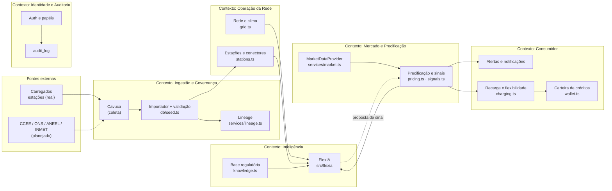

### 15.2 Fluxo de dados e ciclo
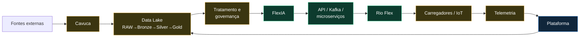
> Legenda: verde = implementado · amarelo = MVP/parcial · azul = planejado. (F é REST hoje; Kafka/microserviços planejados.)

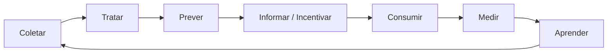

### 15.3 Casos de uso
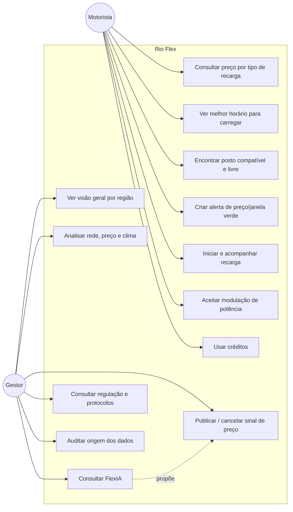

### 15.4 Sequência — sinal de preço: a IA propõe, o humano aprova, o servidor limita
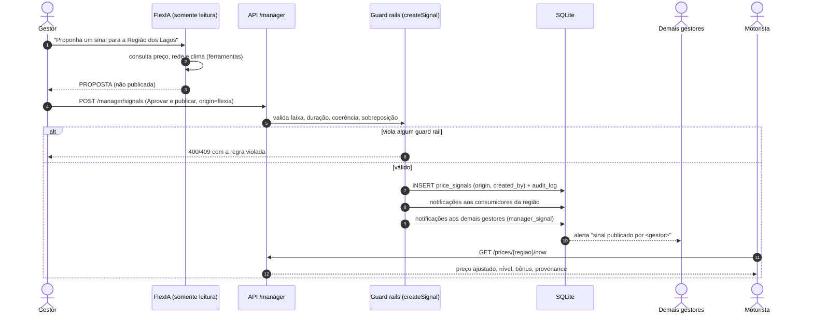

### 15.5 Sequência — recarga com flexibilidade
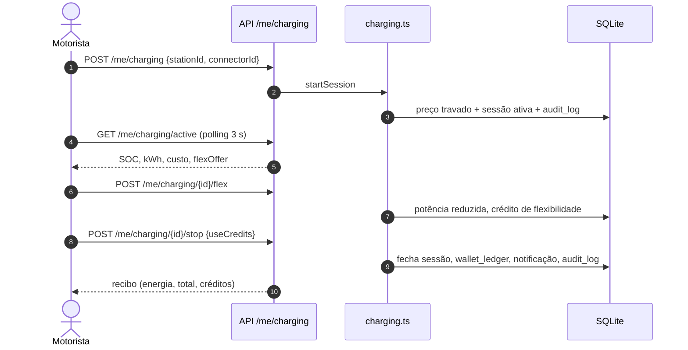

### 15.6 Sequência — rastrear a origem de um dado
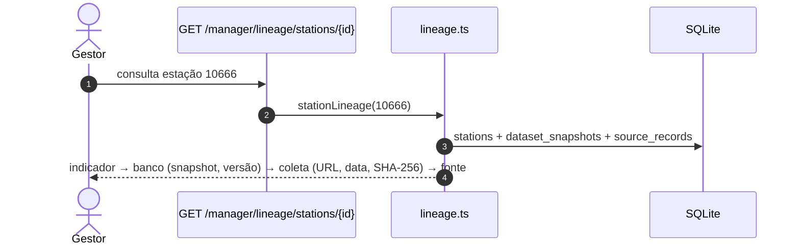

### 15.7 Modelo de relacionamento (ER)
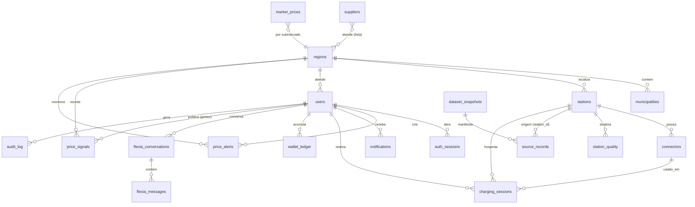

### 15.8 Camadas de dados (alvo × MVP)
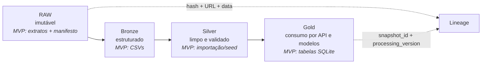

### 15.9 Implantação na AWS
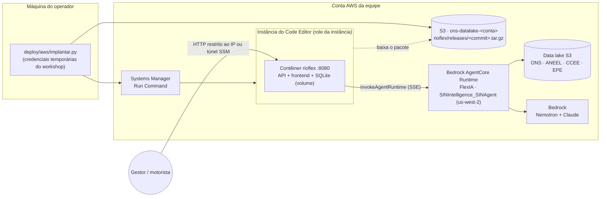

### 15.10 Sequência — pergunta do gestor com roteamento
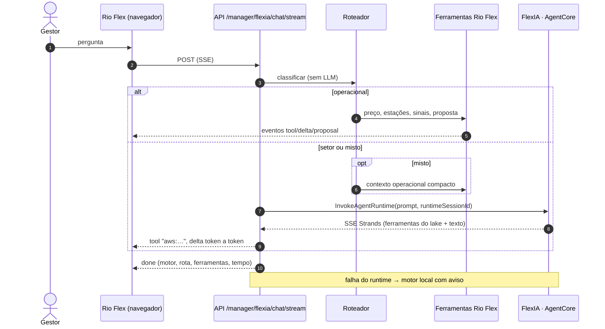

### 15.11 Camadas de controle da decisão de preço
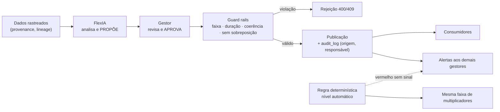

---

## 16. Como rodar

Pré-requisitos: **Node 24+** (usa `node:sqlite`) e **pnpm 10** (ou `npx pnpm@10 …`).

```bash
pnpm install
pnpm dev:api      # API em http://localhost:5000 (cria e popula o banco na 1ª execução)
pnpm dev:web      # Frontend em http://localhost:5173 (proxy /api → :5000; se a porta estiver ocupada o Vite escolhe outra)
```

Outros comandos:
```bash
pnpm typecheck                              # frontend + API
pnpm --filter @workspace/api-server test    # 22 testes
pnpm db:reset                               # limpa e repopula o banco (dados em artifacts/api-server/data/rioflex.db)
pnpm build                                  # build de produção do frontend
```

**Mapa (Mapbox):** defina `MAPBOX_TOKEN` (token público `pk.`) em `artifacts/api-server/.env`, arquivo ignorado pelo git. A API entrega o token ao mapa em tempo de execução via `GET /api/v1/meta`, então ele não fica no código nem no bundle compilado. O mapa oferece os estilos Escuro, Ruas e Satélite; sem token, usa os tiles CARTO. Por ser um token público, ele fica visível no navegador: restrinja-o às URLs do sistema no painel do Mapbox.

Configuração: copie `artifacts/api-server/.env.example` para `.env` (`PORT`, `DB_PATH`, `ALLOWED_ORIGINS`, `SESSION_TTL_HOURS`, `COOKIE_SECURE`, `CHARGING_SIM_SPEED`, `ANTHROPIC_API_KEY`, `FLEXIA_MODEL`).

**Contas de demonstração (somente local; criadas pelo seed):**

| Portal | E-mail | Senha |
|---|---|---|
| Motorista — `/login` | `marcos@rioflex.dev` | `RioFlex@2026` |
| Gestor — `/gestor/login` | `gestora@rioflex.dev` | `Gestor@2026` |

Novos motoristas: `/signup`.

---

## 16.0 Modo recomendado para testes e apresentação: Rio Flex local + FlexIA na AWS

O Rio Flex roda **nesta máquina** (API + frontend + SQLite, modo produção, porta única `8080`). A **FlexIA** — AgentCore, data lake, Bedrock (Nemotron + Claude) — e o **acervo do Cavuca** (coleta agendada que grava os documentos no S3 lidos por `buscar_documentos`) rodam **na AWS**. O microserviço de busca ao vivo do Cavuca (`busca_profunda`) segue local ao projeto FlexIA; quando indisponível, a FlexIA responde pelo acervo indexado.

```powershell
.\scripts\local-aws.ps1                  # testa a FlexIA na AWS, compila o front se preciso e sobe http://localhost:8080
.\scripts\local-aws.ps1 -SoVerificar     # só a conexão: primeiro token, tempo total e ferramentas usadas
.\scripts\local-aws.ps1 -IgnorarFalhaAws # sobe mesmo sem AWS (setor cai no motor local, com aviso)
.\scripts\local-aws.ps1 -Dev             # desenvolvimento: API :5000 + Vite com hot reload
```

- **Credenciais:** lidas do `.env` do projeto FlexIA (`C:\Desenvolvimento\Hackathon\FlexIA\.env`). As chaves temporárias **não** entram no ambiente nem no repositório do Rio Flex: a API **relê o arquivo a cada minuto** (`AWS_CREDENTIALS_ENV_FILE`). Quando as chaves do workshop expirarem, basta rodar `.\configurar.ps1 -SalvarCredenciais` na pasta da FlexIA — o Rio Flex em execução passa a usar as novas **sem reiniciar**.
- **Diagnóstico:** `pnpm flexia:check` classifica a falha (credencial expirada, permissão, ARN/runtime, tempo limite) e mede a latência real; `GET /api/ready` e o selo no topo da tela da FlexIA mostram o motor ativo.
- **Estado:** caminho local → AgentCore → fallback validado ao vivo (com credencial expirada, a pergunta de setor tentou a AWS e caiu no motor local em 0,8 s com aviso). A resposta real da AgentCore depende de credenciais renovadas.

## 16.1 Implantação na AWS

**Por que este desenho.** A conta do workshop bloqueia `iam:PassRole` (sem ECS/Lambda/App Runner com role própria), CloudFront, API Gateway e RDS. O caminho que já funcionou para a FlexIA é a **instância do Code Editor comandada via Systems Manager** — o Rio Flex usa o mesmo, numa **imagem única** (API + frontend + SQLite em volume), com a **role da instância** para chamar a FlexIA. Numa conta sem essas restrições, a mesma imagem sobe em ECS Fargate/App Runner atrás de um ALB com HTTPS.

**Pré-requisitos na máquina do operador:** Python com `boto3` (o venv da FlexIA serve) e credenciais válidas no `.env` da FlexIA (`C:\Desenvolvimento\Hackathon\FlexIA\.env`), atualizadas com `.\configurar.ps1 -SalvarCredenciais`. O script lê desse `.env` a instância (`CODE_EDITOR_INSTANCIA`), o bucket e o `FLEXIA_RUNTIME_ARN`.

```bash
python deploy/aws/implantar.py verificar                    # nada é alterado; testa até a invocação da FlexIA pela instância
python deploy/aws/implantar.py publicar implantar status    # pacote do commit atual -> S3 -> contêiner na instância
python deploy/aws/implantar.py acesso                       # URL ou comando de túnel SSM
python deploy/aws/implantar.py liberar-ip --cidr <ip>/32    # opcional: abre a 8080 só para o IP do apresentador
```

- **Imagem:** `Dockerfile` multi-stage (Node 24, pnpm, build do front, typecheck da API), usuário sem privilégio, `HEALTHCHECK` em `/api/ready`, volume `/data` para o SQLite.
- **Sem Docker na instância:** `--modo node` instala Node 24 via nvm e roda o mesmo código.
- **Variáveis do contêiner:** `deploy/aws/rioflex.env.example` (copie para `rioflex.env` para customizar; fora do git). Para a apresentação: `DEMO_ACCOUNTS=true`, `FLEXIA_BACKEND=agentcore`.
- **Operação:** logs JSON (`docker logs rioflex`), backup do banco com `pnpm --filter @workspace/api-server db:backup` (`VACUUM INTO`, sem parar a API), reimplantação idempotente por commit.

## 17. API implementada

Prefixo `/api/v1`; JSON; cookie de sessão; `X-Requested-With: RioFlex` em métodos de escrita. Tudo abaixo existe em `src/routes/`.

| Rota | Papel | Descrição |
|---|---|---|
| `POST /auth/login` `{email,password,portal}` · `POST /auth/register` · `POST /auth/logout` · `GET/PATCH /auth/me` | — | Sessão e perfil |
| `GET /api/health` · `GET /api/ready` | público | Vida e prontidão (banco, dados, motor da FlexIA) |
| `GET /meta` | público | Tipos de recarga, níveis, regiões, estatísticas da base |
| `GET /stations` (`region, chargeType, available, public, operational, maxPrice, lat, lng, radiusKm, sort, q`) · `/stations/markers` · `/stations/:id` | logado | Estações com preço por tipo, score, disponibilidade e `provenance` |
| `GET /prices` · `/prices/:region/now` · `/prices/:region/forecast` · `/market/pld` · `/signals` | logado | Preço, composição, ofertas, janelas, PLD; inclui `provenance` |
| `GET/POST /me/alerts` · `PATCH/DELETE /me/alerts/:id` | motorista | Alertas |
| `POST /me/charging` · `GET /me/charging/active` · `/history` · `/:id` · `POST /:id/flex` · `POST /:id/stop` | motorista | Recarga |
| `GET /me/wallet` | motorista | Carteira e extrato |
| `GET /notifications` · `POST /notifications/read-all` · `POST /notifications/:id/read` | logado | Notificações |
| `GET /manager/overview` · `/manager/grid/:region` | gestor | Operação agregada |
| `GET/POST /manager/signals` · `DELETE /manager/signals/:id` | gestor | Sinais de preço |
| `GET /manager/knowledge` · `GET /manager/audit` · `GET /manager/guardrails` | gestor | Regulação; auditoria; limites de segurança do sinal |
| `GET /manager/lineage/datasets` · `GET /manager/lineage/stations/:id` | gestor | **Rastreabilidade** |
| `GET /manager/flexia/status` · `GET/DELETE /manager/flexia/conversations[/:id]` · `POST /manager/flexia/chat` · `POST /manager/flexia/chat/stream` (SSE) | gestor | FlexIA — roteada para o AgentCore ou ferramentas locais (não publica nada) |

**Dados reais × simulados:** estações/conectores/preço publicado = **reais** (snapshot 22/09/2026); PLD, ofertas (5 comercializadoras **fictícias**), demanda/geração, clima e disponibilidade = **simulados**. Tarifas do mock **não são homologadas**.

---

## 18. Roteiro de demonstração de 40 segundos

Uma tela por cena, usuário **motorista** (com um corte rápido para o gestor). Fale só a frase de narração.

| Tempo | Ação na tela | Narração |
|---|---|---|
| **0–5 s** | Landing → **Sou motorista** → login → **Início** com o selo 🟡 e o card "Melhor opção agora". | "O Rio Flex mostra ao motorista o sinal da rede e o melhor posto agora." |
| **5–13 s** | **Preços**: cartões AC/DC, curva de 24 h verde-amarelo-vermelho, composição do custo. | "Ele vê quanto custa cada tipo de carga, por que o preço é esse e a melhor janela do dia." |
| **13–19 s** | **Alertas**: criar alerta "DC até R$ 2,20 + janela verde". | "Cria um alerta e é avisado quando vale a pena." |
| **19–27 s** | **Mapa** (828 estações) → tocar em um posto → **Iniciar** → sessão → **Aceitar modulação (+R$ 2,50)**. | "Escolhe um posto compatível, inicia e ajuda a rede reduzindo a potência no pico." |
| **27–31 s** | **Recibo** e **Carteira** com o crédito. | "E recebe créditos por isso." |
| **31–40 s** | Corte para **Gestor** → **FlexIA**: "Proponha um sinal para a Região dos Lagos" → **Aprovar e publicar** → (opcional) `GET /manager/lineage/stations/…` mostrando URL + SHA-256. | "A FlexIA só propõe: o gestor aprova, o servidor aplica os limites de segurança, os outros gestores são alertados e cada dado tem origem, data e hash rastreáveis." |

Dica de gravação: deixe o gestor já logado em outra aba e o sinal da FlexIA pré-carregado; a sessão de recarga é acelerada (`CHARGING_SIM_SPEED`), então a modulação e o recibo cabem em poucos segundos.

---

## 19. Limitações e próximos passos
- Preço, rede e clima são **simulados**; comercializadoras são fictícias; não há cobrança/pagamento nem comando real de carregadores.
- **AWS:** chamada real ao AgentCore a partir do Rio Flex e build da imagem ainda não executados (credenciais do workshop expiradas; Docker Desktop local sem DNS). HTTPS público depende de ALB/CloudFront, bloqueados na conta do workshop. SQLite = uma instância; para escalar horizontalmente, PostgreSQL/Aurora.
- Governança: aprovação em duas etapas (*four-eyes*), limites por perfil de gestor e limites configuráveis pela interface não existem (hoje: um gestor aprova, guard rails fixos no código).
- Não implementados: Cavuca agendado para ONS/ANEEL/CCEE/EPE/INMET, Data Lake em camadas, seleção automática da versão mais válida, normas com vigência, `model_version` e métricas de previsão, Kafka/microserviços, MQTT/WebSocket, OCPP/OCPI, telemetria e identidade de dispositivos IoT, criptografia em repouso, direitos do titular (LGPD), pontos para reserva/prioridade.
- Abertura do mercado livre para baixa tensão: confirmar o marco regulatório vigente antes de qualquer oferta comercial.
- SQLite atende o protótipo; para múltiplas instâncias, migrar para PostgreSQL mantendo as migrações.
- `lib/api-client-react`, `replit.md` e scripts de deploy vieram do template original e não são usados pelo fluxo atual.

Histórico do projeto original: `JORNADA_DO_USUARIO.md` e o prompt de origem (`RIO_FLEX_LOVABLE_MASTER_PROMPT.md`, disponível no histórico do git).
